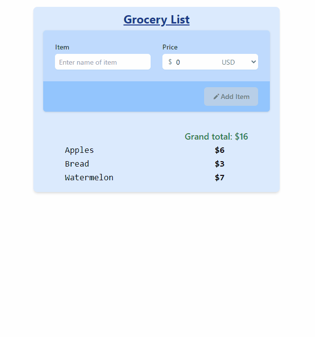

# MyList

A React demonstration with the objective of:

- CRUD commands for a collection
- Input validation: used simple JS conditions
- Styling: implemented Tailwind
- Indicate when user exceed budget of $30
- Tests: Jest + `@testing-library/react`, tests Zustand store too

In addition:

- State management: implemented Zustand with Redux middleware
- Git hooks: Husky + `@commitlint/config-conventional`
- VSCode settings: files included

